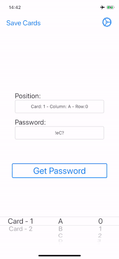

# Paper Passwords - Cryptokit Implementation 
###### 01/05/2020

This is a small aplicación developed to show an implementation of  *prefect paper password* as described in [GRC - Perfect Paper  Passwords](https://www.grc.com/ppp.htm)

 This implementation uses [Apple Cryptokit Framework](https://developer.apple.com/documentation/cryptokit) to replicate the algorithm proposed by [GRC - Perfect Paper Passwords Algorithm ](https://www.grc.com/ppp/algorithm.htm).

### Known Limitations 

 - As the moment of writing, [Cryptokit AES GCM](https://developer.apple.com/documentation/cryptokit/aes/gcm)  doesn’t allow the use of a user defined *Initialization Vector* so the passwords generated by the application can’t be replicated. 
 - Currently Swift doesn’t support a 128 bits unsigned integer so a library was used. 

## Installation 

 - Using *git*, clone the repository from the following url: https://github.com/zippi-MD/PaperPasswords.git
 - In your local repository, make sure you’re in the *master branch* by running `git checkout master` on the local repository directory.
 - Open *PPP-Crypto-Proyect.xcodeproj* file using Xcode 11.3 or above.
 - Build the application using Swift 5.1.
 - Run the application on an iOS simulator or device with iOS 13.1 or above (iPhone 11 is recommended).

## Usage

 - ### Generating passwords
 On first opening of the application you will be prompted with an alert telling you to *generate some passwords*. After selecting this option, you will be presented with a *modal screen* where you can modify the different parameters and generate your passwords.
 
 

- ### Selecting a password
After generating your passwords the modal screen will be automatically dismissed and you will be presented with the main interface. On this screen you’ll be able to select the card, row and column for the desired password and visualize it.

- ### Storing passwords 
After generating some passwords you can store them using a pin, so you can visualize the same passwords after you close the application.

To store your cards you must tap the button on the top left corner of the *pick password* screen, this will present an *alert* where you can introduce a pin to securely store your cards.

- ### Restoring passwords
After generating some cards and closing the application, the next time you open it you’ll be prompted with an alert with two options. 

Selecting the first option (*Decrypt*) will allow you to restore the previously stored cards, to do this you must introduce the *pin* you used to store them. 

        
